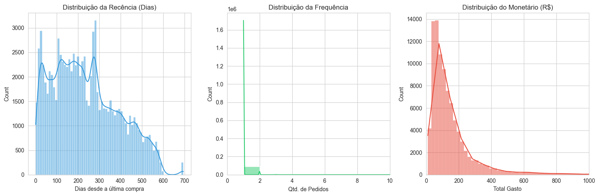
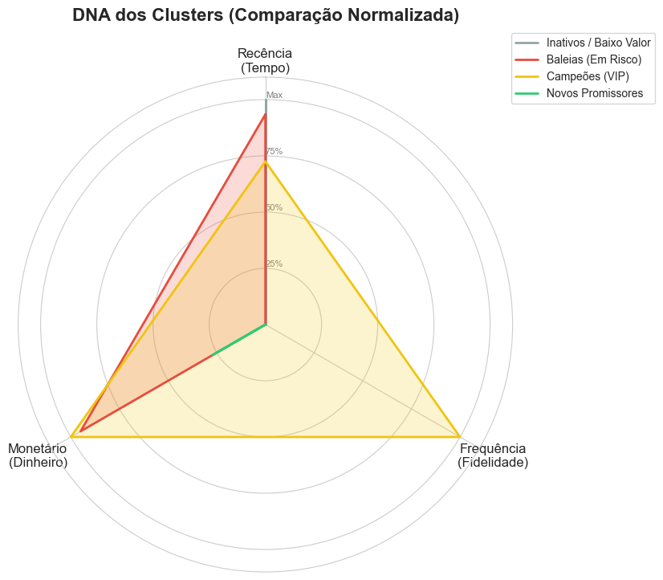
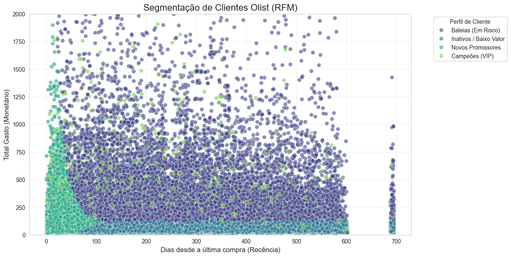

# 🎯 Segmentação de Clientes Olist: Clusterização com RFM e K-Means

## O Problema de Negócio (Business Case)

A **Olist**, um dos maiores e-commerces do Brasil, enfrentava um desafio comum no varejo: a estratégia de marketing "Tamanho Único". 

A empresa tratava todos os clientes da mesma forma, disparando campanhas genéricas tanto para quem gastava R$ 13.000 quanto para quem gastava R$ 50. Isso resultava em:

1.  **Desperdício de Budget:** Investimento em clientes inativos ou Churn.
2.  **Baixa Retenção:** Falta de personalização para os melhores clientes (VIPs).

**O Objetivo:** Utilizar dados históricos de transações (2016-2018) para segmentar a base de clientes automaticamente, permitindo estratégias de retenção personalizadas e aumento do LTV (Lifetime Value).

---

##  A Solução Técnica

O projeto transformou dados transacionais brutos em uma análise comportamental robusta utilizando a metodologia **RFM** e Machine Learning Não-Supervisionado.

### 1. Metodologia RFM

Traduzimos o comportamento de compra em três métricas matemáticas:

* **Recência (R):** Dias desde a última compra (Menor é melhor).
* **Frequência (F):** Quantidade de compras (Maior é melhor).
* **Monetário (M):** Total gasto no período (Maior é melhor).

### 2. Stack Tecnológico

* **Linguagem:** Python
* **Bibliotecas:** Pandas, Numpy (Manipulação), Matplotlib, Seaborn (Visualização), Scikit-Learn (Clusterização).

## Etapas do Projeto (Pipeline)

### 1. Engenharia de Dados & Granularidade

Os dados originais estavam granularizados por *item de pedido*. 

* **Desafio:** A tabela de pagamentos gerava duplicidade (um pedido pago com 2 cartões contava como 2 compras).
* **Solução:** Apliquei agregação com `nunique()` para garantir que a métrica de Frequência contasse apenas pedidos únicos, corrigindo a visão para **Cliente Único**.

### 2. Análise Exploratória & Pré-processamento
Identificamos a assimetria (distribuição "cauda longa") nas variáveis monetárias e de frequência.

**Tratamento Aplicado:**
1.  **Log Transformation (`np.log1p`):** Para comprimir outliers e reduzir assimetria.
2.  **StandardScaler:** Para padronizar as variáveis.

### 3. Modelagem (K-Means)
Utilizamos o **Método do Cotovelo (Elbow Method)** para definir o número ideal de clusters.

* **Decisão:** `K=4`.
* **Justificativa:** O ganho de redução de erro (inércia) estagnou após 4 grupos.

## 📊 Resultados e Visualizações

O modelo identificou 4 perfis comportamentais distintos:

### 1. DNA dos Clusters (Radar Chart)
Visualização da identidade de cada grupo. Note como o **VIP (Amarelo)** expande em todas as dimensões, enquanto o **Novo (Verde)** tem destaque apenas na Recência.

### 2. Fronteiras de Decisão (Scatter Plot)
A distribuição real dos clientes considerando Recência (Tempo) vs Monetário (Dinheiro).

## 💡 Personas e Estratégia Sugerida

| Cluster | Nome do Perfil | Características (Centróides) | Estratégia de Marketing Sugerida |
| :--- | :--- | :--- | :--- |
| **2** |  **Campeões (VIP)** | Alta Frequência (>2), Alto Ticket, Recência Média. | **Fidelização:** Programas exclusivos, "Mimos", Acesso antecipado. Não dar desconto. |
| **3** |  **Novos Promissores** | Recência baixíssima (<50 dias), Frequência 1. | **Ativação:** Incentivo à 2ª compra (Cross-sell) urgente enquanto estão "quentes". |
| **1** |  **Baleias (Em Risco)** | Alto Ticket (similar ao VIP), mas compraram 1x há muito tempo. | **Reconquista:** Ofertas agressivas de produtos premium para evitar Churn definitivo. |
| **0** |  **Inativos** | Baixo Ticket, Alta Recência (há muito tempo sem comprar). | **Automação:** Régua de e-mail genérica. Evitar gastos com mídia paga. |

